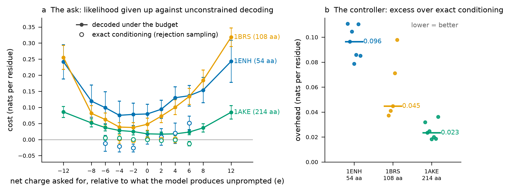

# What the net-charge budget costs

Asking the redesign stage for a net charge makes it emit less typical sequences, and the question
is how much less. Measured on three single-domain globular proteins spanning the size range a
binder campaign works in, **every one of 1056 designs landed on its target charge**, and the price
was 0.02-0.32 nats per residue depending on how far the ask was from what the model wanted anyway
and how much chain there was to absorb it.



**Figure.** *(a)* Mean per-residue negative log-likelihood above unconstrained decoding on the same
backbone, against the charge asked for, stated relative to the charge that backbone's unconstrained
designs average (+1 for 1ENH, +3 for 1BRS, -5 for 1AKE). Filled markers are designs decoded under
the budget (n = 32 per point); open markers are exact conditioning by rejection sampling, that is,
the unconstrained designs that already happened to carry that charge (n = 13 to 83, only where the
pool supplied at least 10). Bars are 95% confidence intervals of the mean. Open markers below zero
are real: conditioning on a charge the model already likes can be cheaper than the pool average.
*(b)* The vertical gap between the two - what the controller spends above exact conditioning - with
the median marked; n = 7, 5 and 7 conditions.

## The two questions, and why the second one needs rejection sampling

The first question is what the *ask* costs: decode under the budget and compare with unconstrained
decoding on the same backbone. That is panel (a), and it mixes two things — the fact that some
charges are genuinely less natural for a fold, and whatever distortion the controller introduces
on top.

Rejection sampling separates them. Drawing a large unconstrained pool and keeping the designs that
already have charge *c* realises p(sequence | charge = c) exactly, so their mean likelihood is what
conditioning *should* cost. Anything the constrained sampler spends above that line is the
controller's own overhead, and that is panel (b). This is the yardstick the reference
implementation uses (profdocpizza/LigandMPNN, `benchmarks/bench_rejection.py`), and it is the one
that matters: a controller can hit its target perfectly and still be worthless if it gets there by
mangling the distribution.

## Results

| Backbone | | Length | Unconstrained NLL | Charge it prefers | On target | Cost at ±6 e | Cost at ±12 e | Controller overhead (median, range) |
|---|---|---|---|---|---|---|---|
| 1ENH | engrailed homeodomain | 54 | 1.028 | +1 | 352/352 | 0.099-0.136 | 0.242-0.243 | 0.096 (0.079-0.111) |
| 1BRS | barnase | 108 | 0.695 | +3 | 352/352 | 0.062-0.134 | 0.255-0.318 | 0.045 (0.037-0.098) |
| 1AKE | adenylate kinase | 214 | 0.809 | -5 | 352/352 | 0.023-0.037 | 0.085-0.086 | 0.023 (0.018-0.036) |

All figures are nats per residue. "Cost" is against unconstrained decoding on the same backbone;
"overhead" is against exact conditioning at the same charge.

Three things to take from it.

**The budget is met, always.** 1056 of 1056 designs carried exactly the charge asked for, across
targets from 12 e below to 12 e above the model's own preference. That is the hard reachability
mask doing its job; it is a guarantee, not a bias.

**Length is what sets the price.** The same 6 e shift costs 0.10-0.14 nats per residue on a 54-mer
and 0.02-0.04 on a 214-mer, because the demand is spread over four times as many positions. Read
the ask in charge units per residue, not in charge units: a binder of 60-90 residues sits nearer
the expensive end of this panel than adenylate kinase does.

**Most of the price is the ask, once the ask is large.** At ±12 e the controller's overhead is a
small part of a cost dominated by the shift itself. Close to the model's own preference the
relationship inverts - there the true conditional costs nearly nothing, so almost all of the
(small) cost is overhead. Either way the overhead itself stays between 0.018 and 0.111 nats per
residue, and shrinks with chain length, which is the behaviour the normal approximation in the
lookahead predicts: it is a central-limit argument, so it tightens as more positions remain.

## What this does not show

Nothing here was folded, expressed or made. Per-residue likelihood under the model is a cheap proxy
for design quality, not evidence of it; whether a charge-shifted design still refolds to its
backbone is what a campaign's own refold and filter stages are for. The panel is three backbones,
not a survey — enough to show the length dependence, not enough to quote a coefficient. And the
pool that supplies the rejection reference only reaches charges the model produces on its own, so
the reference is missing exactly where the ask is largest.

## Reproducing it

```bash
python benchmarks/charge_cost.py          # ~2 min on one GPU; fetches 1ENH, 1BRS, 1AKE from RCSB
python benchmarks/plot_charge_cost.py     # redraws the figure from the summary CSV
```

Per-design rows are in `benchmarks/results/charge_cost_designs.csv` and the per-target summary in
`benchmarks/results/charge_cost_summary.csv`. Structures are fetched on demand and not kept in the
repository. The run behind this page used a 512-design unconstrained pool and 32 designs per
target, `mpnn_variant: neutral`, temperature 0.1, on one RTX 5090.
